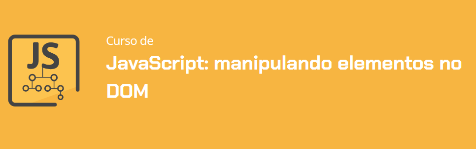

# Fokus 1.0

Este projeto faz parte do meu aprendizado de JavaScript, no curso da Alura: JavaScript: manipulando elementos no DOM 

Neste curso desenvolvi o projeto **Fokus**, que é um aplicativo baseado no **método pomodoro**, que se baseia em períodos mais longos de trabalho ou estudo, seguidos de pausas curtas para descanso e pausas longas para recobrar as energias. 

Link dos designs da aplicação: https://www.figma.com/design/dEaMv34Wd5G7TBMPo8fPlK/Projeto-Fokus?node-id=35-181&p=f&t=2IKnCzz7ufoADUM4-0

## Sobre o projeto

Esse projeto é uma aplicação web simples e interativa que permite aos usuários adicionar, editar, visualizar e remover tarefas, tudo em um ambiente visual agradável e amigável. ELe foi utilizado principalmente para desenvolver minhas habilidades em JavaScript e manipulação da DOM.

## Funcionalidades do projeto

1. Gestão dos períodos de foco: você pode escolher quanto tempo focar, assim como os períodos de pausa;
2. Uso de elementos sonoros para alertas: para avisar o usuário de quando for o momento para descansar um pouco, um alerta sonoro é ativado;
3. Estilização dinâmica de elementos: de acordo com o estado de foco, pausa, ou descanso longo o visual da aplicação muda, para fácil uso do sistema.

## Técnicas e Tecnologias

- Manipulação da DOM: aprendi a manipular a estrutura da página com JavaScript, criando, removendo e alterando elementos HTML;
- Eventos JavaScript: utilizei o poder dos eventos JavaScript para criar uma interface interativa e responsiva;
- Audio: utilizei desse recurso para poder alertar o usuário dos momentos de foco ou de pausa.

## Como Abrir e Rodar o Projeto

1. Certifique-se de que você tem um navegador web moderno instalado. Recomendo o uso do Google Chrome ou Mozilla Firefox;
2. Abra a pasta onde o projeto foi baixado ou extraído, você encontrará um arquivo chamado index.html, a raíz do projeto;
3. Ao abrir o arquivo index.html, o projeto será aberto em seu navegador padrão, e você já poderá utilizar a aplicação de gerenciamento de tarefas.

Você encontrará dois arquivos principais que contêm o código que do sistema:

- script.js: o script que contém as funcionalidades JavaScript do projeto;
- styles.css: onde a beleza do projeto é criada, com todos os estilos CSS que transformam a aparência do sistema.

Com isso, o sistema conta com uma funcionalidade de **pomodoro completa!**
